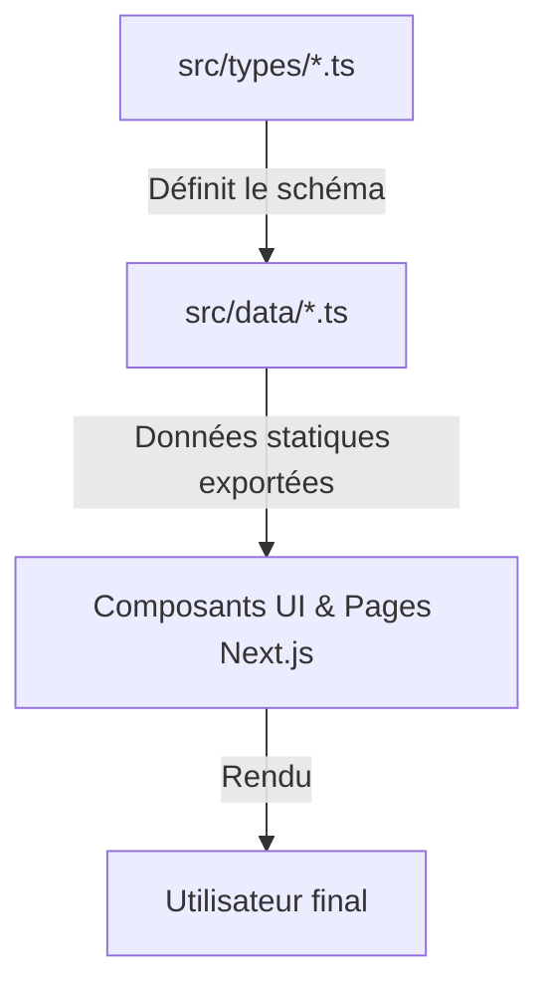
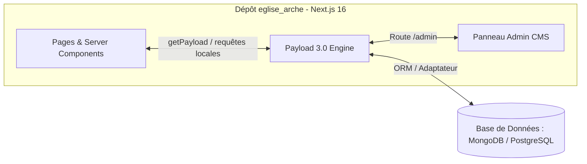

# Guide d'Intégration et Architecture : Payload CMS pour `eglise_arche`

Ce document présente l'analyse architecturale et la stratégie de migration pour intégrer **Payload CMS** dans le projet **Arche de l'Alliance (`eglise_arche`)**, actuellement basé sur **Next.js 16.2 (App Router)**, **React 19** et **Tailwind CSS v4**.

---

## 1. Analyse de l'Architecture Actuelle

Le projet dispose d'une séparation claire entre la couche de données et l'interface utilisateur :



### Points forts de la structure actuelle :
1. **Typage strict et centralisé (`src/types/`)** : Les interfaces (`Ministry`, `Event`, `Sermon`, `Pastor`, etc.) définissent déjà le contrat de données exact dont le front-end a besoin.
2. **Couche de données isolée (`src/data/`)** : Le contenu (les ministères comme *Union Musicale*, *Évangélisation et Suivi*, *Communication Chrétienne et Médias*, etc.) n'est pas codé en dur au milieu du JSX des composants, mais exporté proprement sous forme d'énumérations et tableaux TypeScript.
3. **Consommation propre (`src/app/` & `src/components/`)** : Les composants importent directement ces structures, par exemple `import { ministries } from "@/data/ministries"`.

> [!NOTE]
> **Conclusion architecturale :** Grâce à ce découplage, le passage à Payload CMS **ne nécessitera aucune modification des composants UI ou du design**. Nous allons simplement remplacer la source de vérité (`src/data/*.ts`) par une source dynamique alimentée par Payload.

---

## 2. Les Deux Stratégies d'Intégration Possibles

Avec **Payload CMS 3.x** (compatible nativement avec Next.js App Router et React 19), deux approches sont possibles.

### Option A : Intégration Native & Embarquée (Recommandée)
Payload CMS s'installe **dans le même dépôt** Next.js (`eglise_arche`). Il ajoute une route d'administration `/admin` et s'exécute directement dans le runtime de l'application.



* **Avantages :** Un seul dépôt à gérer (`Monorepo / Single App`), pas de serveur d'API séparé, requêtes ultra-rapides sans surcharge réseau (`Local API`), gestion native du cache de Next.js.
* **Idéal pour :** Une gestion simplifiée par l'équipe technique de l'église.

### Option B : Architecture Headless Séparée (CMS indépendant)
Payload CMS est hébergé sur un projet séparé (ex: `admin.arche-alliance.org`) avec son propre serveur Node.js/Next.js. Le front-office (`eglise_arche`) consomme l'API via `fetch()`.

* **Avantages :** Découplage total, possibilité d'utiliser ce même CMS pour d'autres plateformes (ex: application mobile de l'église à l'avenir).
* **Inconvénients :** Deux projets distincts à déployer et à maintenir.

---

## 3. Guide de Mise en Œuvre (Option A : Intégration Native)

### Étape 1 : Installation des dépendances
Dans la racine du projet `eglise_arche`, installer le plugin Next.js pour Payload et l'adaptateur de base de données de votre choix (par exemple MongoDB ou PostgreSQL/Vercel Postgres) :

```bash
npm install payload @payloadcms/next @payloadcms/richtext-lexical
npm install @payloadcms/db-mongodb # ou @payloadcms/db-postgres
```

### Étape 2 : Configuration des Schémas (`src/collections/`)
À partir de vos définitions existantes dans `src/types/`, créez les collections Payload correspondantes. 

Exemple pour la collection des **Ministères** (`src/collections/Ministries.ts`) :

```typescript
import type { CollectionConfig } from 'payload'

export const Ministries: CollectionConfig = {
  slug: 'ministries',
  admin: {
    useAsTitle: 'name',
    defaultColumns: ['name', 'leader', 'meetingTime'],
  },
  access: {
    read: () => true, // Lecture publique pour le site
  },
  fields: [
    {
      name: 'name',
      type: 'text',
      required: true,
      label: 'Nom du Ministère',
    },
    {
      name: 'slug',
      type: 'text',
      required: true,
      unique: true,
      label: 'Slug URL (ex: evangelisation-et-suivi)',
    },
    {
      name: 'description',
      type: 'textarea',
      required: true,
      label: 'Description courte (pour les cartes)',
    },
    {
      name: 'fullDescription',
      type: 'textarea', // Ou 'richText' pour du formatage avancé
      label: 'Description complète détaillée',
    },
    {
      name: 'icon',
      type: 'select',
      options: [
        { label: 'Musique (Union Musicale)', value: 'Music' },
        { label: 'Flamme (Intercession / Jeunesse)', value: 'Flame' },
        { label: 'Cœur (Ministère des Femmes)', value: 'Heart' },
        { label: 'Bouclier (Ministère des Hommes)', value: 'Shield' },
        { label: 'Bébé (Enfants)', value: 'Baby' },
        { label: 'Mégaphone (Évangélisation)', value: 'Megaphone' },
        { label: 'Radio (Communication / Médias)', value: 'Radio' },
        { label: 'Main (Action Sociale)', value: 'HandHelping' },
      ],
      defaultValue: 'Heart',
    },
    {
      name: 'image',
      type: 'upload',
      relationTo: 'media',
      label: 'Image de couverture',
    },
    {
      name: 'leader',
      type: 'text',
      label: 'Responsable / Leader',
    },
    {
      name: 'activities',
      type: 'array',
      label: 'Activités principales',
      fields: [
        {
          name: 'activity',
          type: 'text',
        },
      ],
    },
    {
      name: 'meetingTime',
      type: 'text',
      label: 'Horaires de réunion (ex: Samedi 14h00 - 17h00)',
    },
  ],
}
```

### Étape 3 : Fichier de configuration général (`payload.config.ts`)
Créer la configuration centrale sous `src/payload.config.ts` :

```typescript
import { buildConfig } from 'payload'
import { mongooseAdapter } from '@payloadcms/db-mongodb' // ou postgresAdapter
import { lexicalEditor } from '@payloadcms/richtext-lexical'
import path from 'path'
import { fileURLToPath } from 'url'
import { Ministries } from './collections/Ministries'
import { Events } from './collections/Events'
import { Media } from './collections/Media'

const __filename = fileURLToPath(import.meta.url)
const __dirname = path.dirname(__filename)

export default buildConfig({
  admin: {
    user: 'users',
  },
  collections: [
    Ministries,
    Events,
    Media,
    // Ajouter progressivement : Sermons, Pastors, Gallery, Testimonials...
  ],
  editor: lexicalEditor(),
  secret: process.env.PAYLOAD_SECRET || 'secret-key-a-changer-en-prod',
  typescript: {
    outputFile: path.resolve(__dirname, 'payload-types.ts'),
  },
  db: mongooseAdapter({
    url: process.env.DATABASE_URI || 'mongodb://127.0.0.1/eglise_arche',
  }),
})
```

### Étape 4 : Activation du panneau d'administration (`/admin`)
Dans App Router de Next.js (`src/app/(payload)/admin/[[...segments]]/page.tsx`), monter le composant admin de Payload :

```tsx
/* This route catches all /admin/* requests and renders the Payload Admin UI */
import { RootPage, generatePageMetadata } from '@payloadcms/next/views'
import importMap from '@/app/(payload)/admin/importMap'
import config from '@payload-config'

type Args = {
  params: Promise<{
    segments: string[]
  }>
  searchParams: Promise<{
    [key: string]: string | string[]
  }>
}

export const generateMetadata = ({ params, searchParams }: Args) =>
  generatePageMetadata({ config, params, searchParams })

const Page = ({ params, searchParams }: Args) =>
  RootPage({ config, params, searchParams, importMap })

export default Page
```

---

## 4. Stratégie de Transition & Migration en Douceur

Pour éviter de perturber le développement actuel, voici comment effectuer la transition dans la couche de données sans modifier l'interface visuelle :

### Transformer `src/data/*.ts` en abstraction asynchrone

Au lieu de supprimer brutalement `src/data/ministries.ts`, on peut y écrire une fonction ou conserver un mode hybride :

```diff
- export const ministries: Ministry[] = [ ... ]
+ import { getPayload } from 'payload'
+ import configPromise from '@payload-config'
+ import type { Ministry } from '@/types'
+
+ export async function getMinistries(): Promise<Ministry[]> {
+   const payload = await getPayload({ config: configPromise })
+   const response = await payload.find({
+     collection: 'ministries',
+     depth: 1,
+   })
+   
+   // Mappage des données de Payload vers l'interface existante du front-end
+   return response.docs.map((doc: any) => ({
+     id: doc.id,
+     slug: doc.slug,
+     name: doc.name,
+     description: doc.description,
+     fullDescription: doc.fullDescription,
+     icon: doc.icon,
+     image: typeof doc.image === 'object' ? doc.image?.url : '/images/ministries/default.jpg',
+     leader: doc.leader,
+     activities: doc.activities?.map((a: any) => a.activity) || [],
+     meetingTime: doc.meetingTime,
+   }))
+ }
```

Ensuite, dans `src/app/ministeres/page.tsx`, il suffit de passer la page en composant serveur asynchrone :

```diff
- export default function MinisteresPage() {
+ export default async function MinisteresPage() {
+   const ministriesData = await getMinistries();
    return (
      ...
-     {ministries.map((ministry, index) => {
+     {ministriesData.map((ministry, index) => {
```

> [!TIP]
> **Bonne pratique : Migration incrémentale**
> Il est recommandé de migrer collection par collection : par exemple, commencer par les **Événements** (`Events`) qui changent fréquemment, puis les **Prédications** (`Sermons`), et enfin les **Ministères** (`Ministries`) et les **Témoignages** (`Testimonials`).
